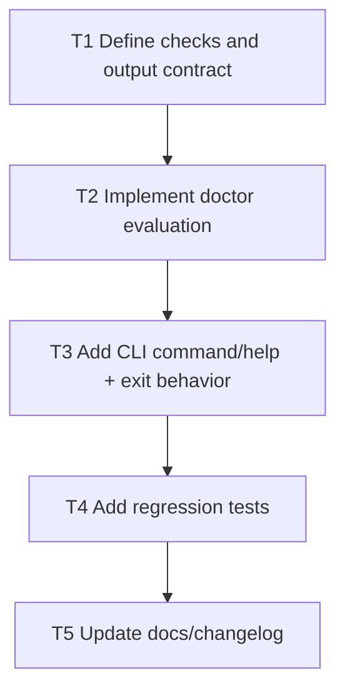

# F1 Plan: `setzkasten doctor`

## Objective
Add repository health diagnostics to speed onboarding and CI adoption.

## Dependency Graph

## Tasks
- `T1` Define checks and output contract (`depends_on: []`)
- `T2` Implement check engine (manifest presence/validity, event log presence, BYO linkage/evidence) (`depends_on: [T1]`)
- `T3` Add `doctor` command, `--strict`, and deterministic JSON output (`depends_on: [T2]`)
- `T4` Add CLI tests for healthy and failing scenarios (`depends_on: [T3]`)
- `T5` Update README and package CLI docs (`depends_on: [T4]`)

## Acceptance Criteria
- `setzkasten doctor` exits `0` when only pass/warn and no strict mode.
- `setzkasten doctor --strict` exits non-zero on warn/error.
- Output includes machine-readable check IDs and remediation hints.
