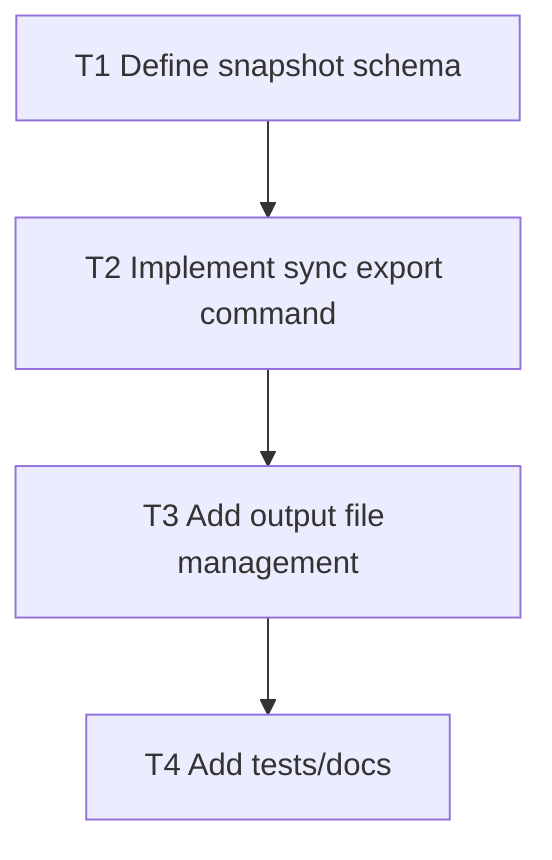

# F10 Plan: `sync export` Snapshot

## Objective
Produce a stable project snapshot for local dashboards/API consumers.

## Dependency Graph

## Tasks
- `T1` Define snapshot fields (project metadata, policy decision, quote totals, evidence health) (`depends_on: []`)
- `T2` Implement `sync export` command to build snapshot payload (`depends_on: [T1]`)
- `T3` Write snapshot to `.setzkasten/sync/latest.json` with optional custom output path (`depends_on: [T2]`)
- `T4` Add regression tests and docs (`depends_on: [T3]`)

## Acceptance Criteria
- Snapshot output is deterministic and includes source timestamp/hash.
- Command works offline and does not require network.
- Output path handling is safe and explicit.
