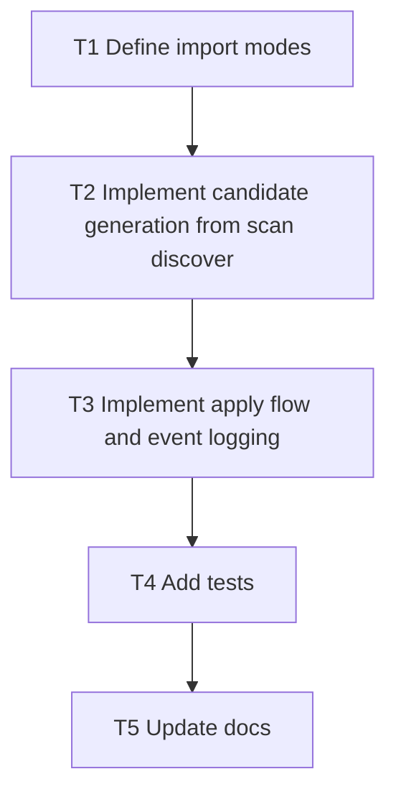

# F2 Plan: `setzkasten import`

## Objective
Bootstrap manifest entries from discovered repository font files.

## Dependency Graph

## Tasks
- `T1` Define dry-run default, `--apply`, and source defaults (`depends_on: []`)
- `T2` Build import candidates from discovered fonts and dedupe against existing manifest (`depends_on: [T1]`)
- `T3` Apply additions to manifest + append import events (`depends_on: [T2]`)
- `T4` Add tests for dry-run and apply behavior (`depends_on: [T3]`)
- `T5` Document import workflow in README (`depends_on: [T4]`)

## Acceptance Criteria
- Dry-run lists candidates and does not mutate manifest.
- Apply writes new fonts and events deterministically.
- Existing `font_id` values are not duplicated.
