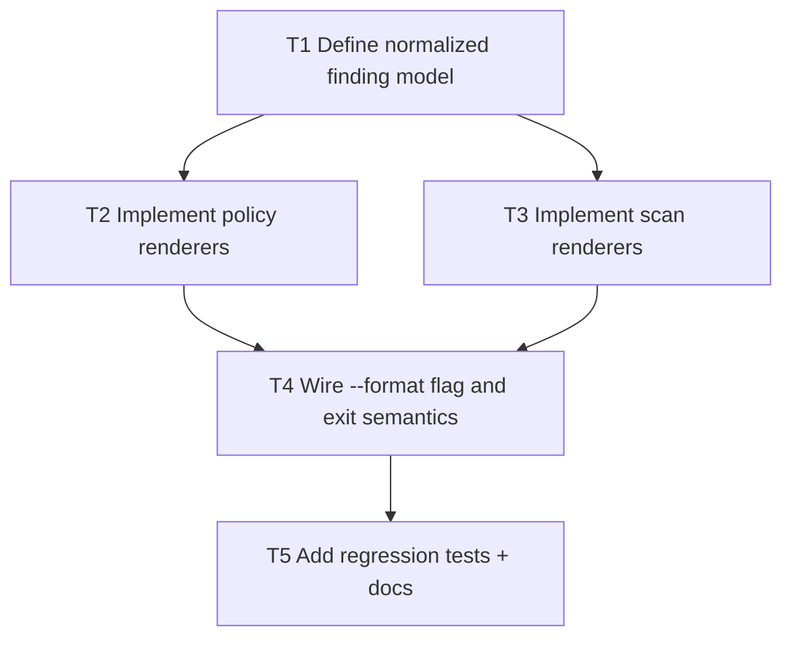

# F3 Plan: CI Output Formats (`sarif`, `junit`)

## Objective
Make `scan` and `policy` outputs consumable by CI/security tooling.

## Dependency Graph

## Tasks
- `T1` Define shared finding structure across commands (`depends_on: []`)
- `T2` Add policy SARIF/JUnit serialization (`depends_on: [T1]`)
- `T3` Add scan SARIF/JUnit serialization (`depends_on: [T1]`)
- `T4` Add `--format json|sarif|junit` support (`depends_on: [T2, T3]`)
- `T5` Add tests and update command docs (`depends_on: [T4]`)

## Acceptance Criteria
- `scan` and `policy` default JSON behavior remains backward-compatible.
- SARIF output validates structurally and includes rule IDs/messages.
- JUnit output includes deterministic suite/test counts.
