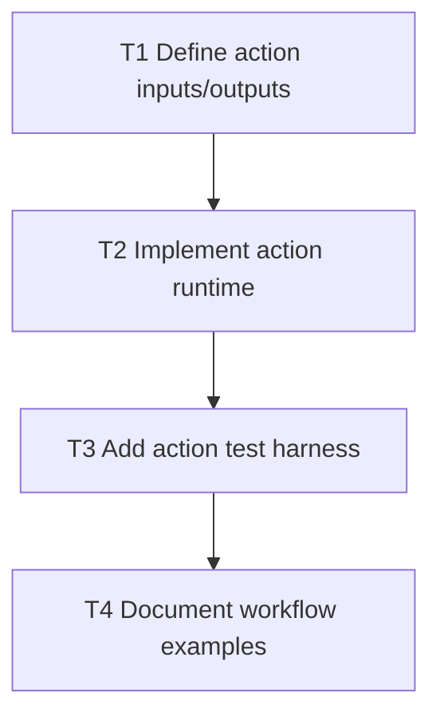

# F4 Plan: GitHub Action License Guard

## Objective
Ship a working GitHub Action that runs Setzkasten policy checks in CI.

## Dependency Graph

## Tasks
- `T1` Finalize `action.yml` inputs (`manifest_path`, `working_directory`, `fail_on`, `format`) (`depends_on: []`)
- `T2` Implement node entrypoint invoking `setzkasten policy` with configured failure threshold (`depends_on: [T1]`)
- `T3` Add tests for pass/fail behaviors (`depends_on: [T2]`)
- `T4` Add usage docs for repository workflow integration (`depends_on: [T3]`)

## Acceptance Criteria
- Action fails workflow on configured policy severity.
- Action writes structured output to logs.
- Example workflow works without custom scripts.
