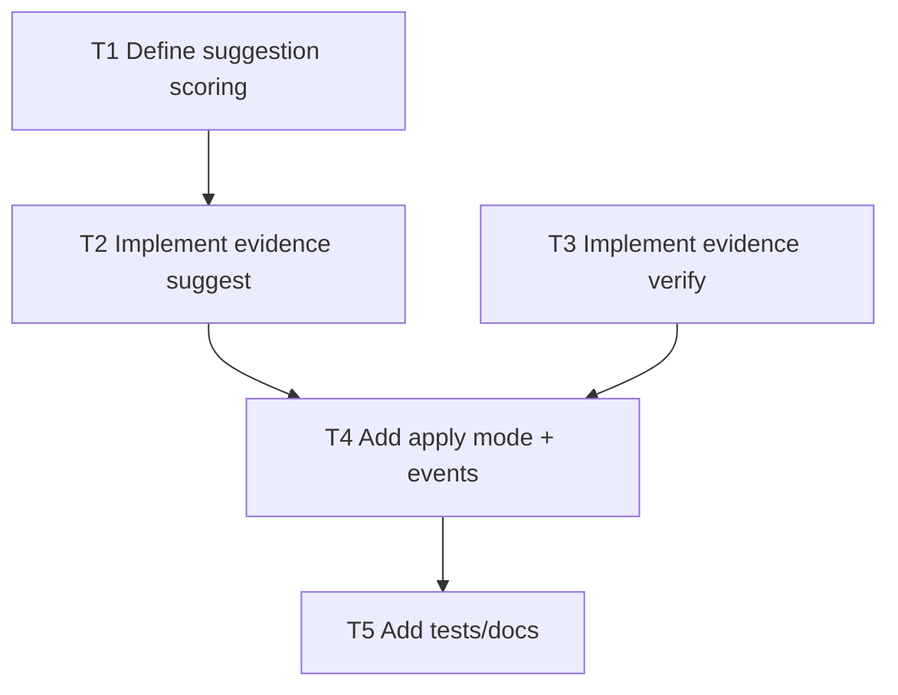

# F5 Plan: `evidence suggest` + `evidence verify`

## Objective
Reduce manual evidence operations and detect stale/missing evidence files.

## Dependency Graph

## Tasks
- `T1` Define match strategy between discovered license files and license instances (`depends_on: []`)
- `T2` Add `evidence suggest` output with confidence and candidates (`depends_on: [T1]`)
- `T3` Add `evidence verify` hash/file existence checks (`depends_on: [T1]`)
- `T4` Add `evidence suggest --apply` to attach evidence automatically (`depends_on: [T2, T3]`)
- `T5` Add regression tests and docs (`depends_on: [T4]`)

## Acceptance Criteria
- Suggestion output references `license_id`, file path, hash, confidence.
- Verify reports `ok`, `missing_file`, `hash_mismatch`.
- Apply mode is deterministic and idempotent.
