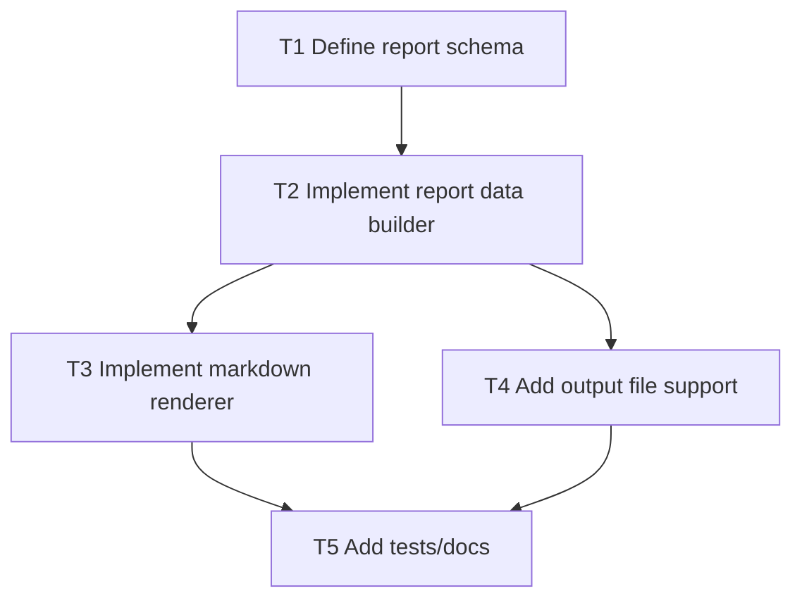

# F6 Plan: `setzkasten report`

## Objective
Generate auditor-friendly project summaries in JSON and Markdown.

## Dependency Graph

## Tasks
- `T1` Define canonical report fields (policy, quote, evidence, events summary) (`depends_on: []`)
- `T2` Build report payload from manifest + event log (`depends_on: [T1]`)
- `T3` Render markdown report (`depends_on: [T2]`)
- `T4` Add `--format` + `--output` support (`depends_on: [T2]`)
- `T5` Add tests and docs (`depends_on: [T3, T4]`)

## Acceptance Criteria
- `report --format json` returns machine-friendly payload.
- `report --format markdown` is readable and deterministic.
- `--output` writes file atomically.
