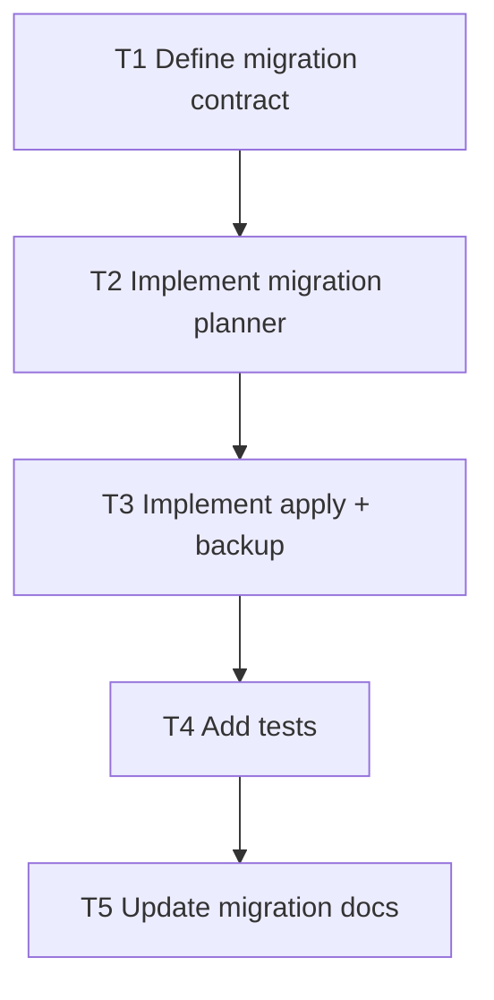

# F7 Plan: Real `setzkasten migrate`

## Objective
Replace migration stub with safe dry-run/apply behavior and backups.

## Dependency Graph

## Tasks
- `T1` Define command flags (`--to-version`, `--apply`) and output contract (`depends_on: []`)
- `T2` Implement planner for known transforms and no-op detection (`depends_on: [T1]`)
- `T3` Implement apply mode with backup creation and event logging (`depends_on: [T2]`)
- `T4` Add migration tests for dry-run and apply (`depends_on: [T3]`)
- `T5` Update docs/changelog (`depends_on: [T4]`)

## Acceptance Criteria
- Default mode is non-destructive and describes actions.
- Apply mode creates backup and writes transformed manifest.
- Unsupported target versions fail with clear error.
