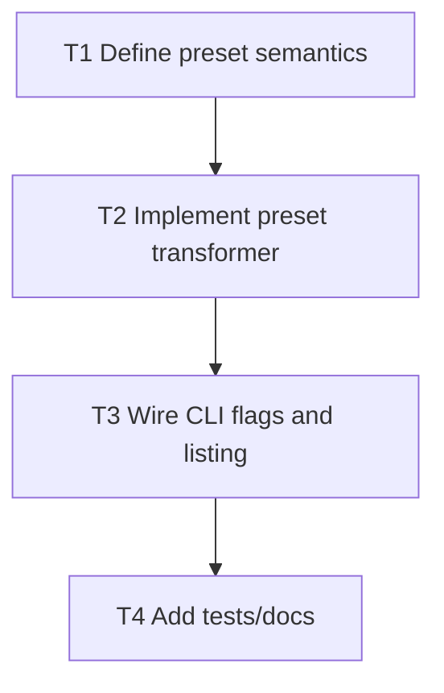

# F8 Plan: Policy Presets

## Objective
Provide opinionated policy modes for different team maturity levels.

## Dependency Graph

## Tasks
- `T1` Define behavior for `strict`, `startup`, `enterprise` (`depends_on: []`)
- `T2` Implement reason severity/decision transformation by preset (`depends_on: [T1]`)
- `T3` Add `policy --preset <name>` and `policy presets` command support (`depends_on: [T2]`)
- `T4` Add policy tests for each preset and update docs (`depends_on: [T3]`)

## Acceptance Criteria
- Preset usage is explicit and reflected in output metadata.
- Default policy behavior remains unchanged.
- Preset list is machine-readable for automation.
