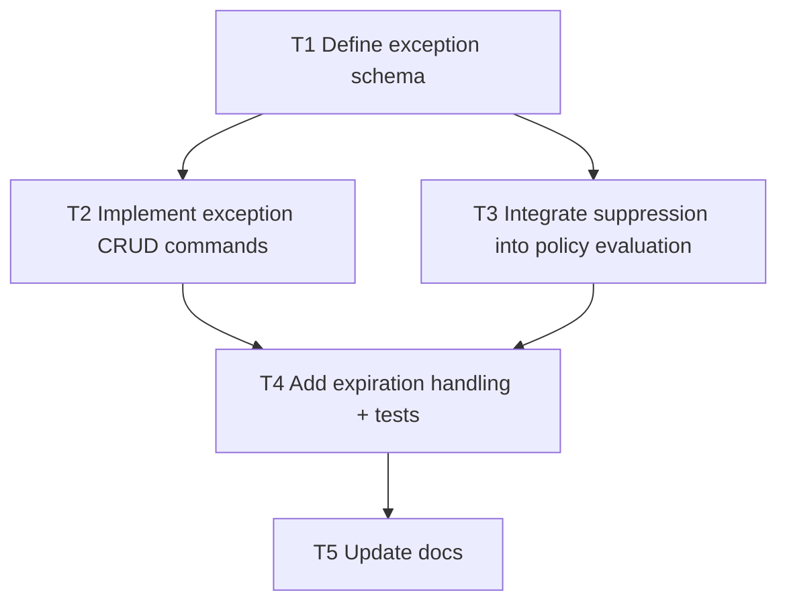

# F9 Plan: Policy Exceptions

## Objective
Add auditable time-bound waivers for policy findings.

## Dependency Graph

## Tasks
- `T1` Define `policy_exceptions[]` model (`exception_id`, `code`, optional scope, `expires_at`, `reason`) (`depends_on: []`)
- `T2` Add `exception add|list|remove` command set (`depends_on: [T1]`)
- `T3` Suppress matching policy reasons when active exceptions exist (`depends_on: [T1]`)
- `T4` Add expiration behavior and regression tests (`depends_on: [T2, T3]`)
- `T5` Document governance workflow (`depends_on: [T4]`)

## Acceptance Criteria
- Exceptions are explicit, traceable, and removable.
- Expired exceptions do not suppress findings.
- Policy output shows suppressed reasons and active exception IDs.
