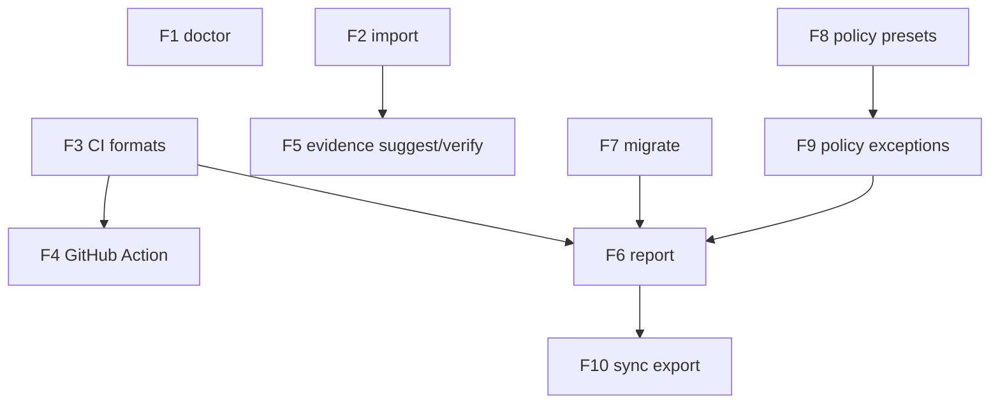

# Setzkasten Growth Roadmap (Created March 2, 2026)

## Goal
Convert CLI downloads into repeat CI adoption and auditable team workflows.

## Milestones
- M1: `v0.3.0` Foundation Ops (Doctor, Import, CI Formats) target: March 9, 2026
- M2: `v0.4.0` Workflow Depth (Evidence Suggest/Verify, Reporting, Migrate) target: March 16, 2026
- M3: `v0.5.0` Team Controls (Presets, Exceptions, Sync Export, GitHub Action GA) target: March 23, 2026

## Feature List
- F1 `doctor` command
- F2 `import` command
- F3 CI output formats (`sarif`, `junit`) for `scan` and `policy`
- F4 GitHub Action License Guard implementation
- F5 `evidence suggest` and `evidence verify`
- F6 `report` command (json/markdown)
- F7 real `migrate` workflow (dry-run/apply/backup)
- F8 policy presets (`strict`, `startup`, `enterprise`)
- F9 policy exception workflow (add/list/remove + suppression)
- F10 `sync export` snapshot for dashboards/APIs

## Cross-Feature Dependency Graph

## Execution Order
1. F1
2. F2
3. F3
4. F4
5. F5
6. F7
7. F8
8. F9
9. F6
10. F10
